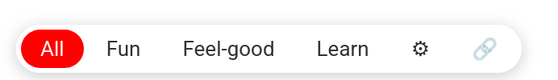
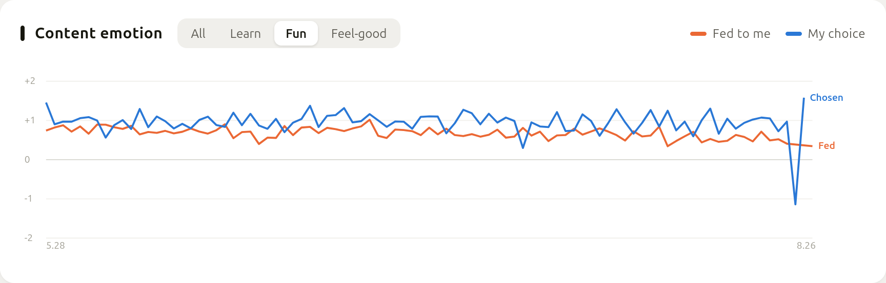
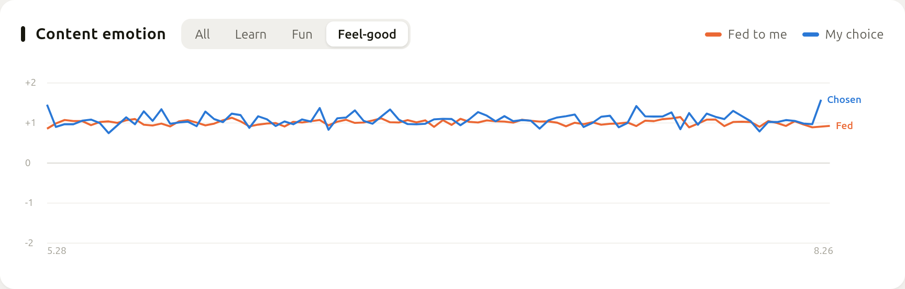

# Feed Mode

**One-click filter for your Bilibili / YouTube home feed: Learn · Feel-good · Fun**

English | [中文](README.zh-CN.md)

## ✨ Features

- **Four modes**: All / Fun / Feel-good (healing, comedy, talent, pets — filters rage-bait, shock content and anxiety-mongering) / Learn (science, tech, finance, documentaries with a calm tone — clickbait "analysis" doesn't count)
- **Built-in local model**: works offline out of the box
- **Optional cloud review**: add a DeepSeek API key for higher accuracy; usage and cost shown live, with a tolerance slider to control how much goes to the cloud — slide it to the end to turn the cloud off entirely and run fully offline
- **Hands off business**: no ad blocking, no link rewriting — creator revenue is untouched

## 📊 Does it actually improve the feed?

Measured, not claimed. The four-way content filter and the emotion model are trained separately on different label sets, so their agreement is independent evidence. On 2,368 real videos:

| Mode | Videos | Mean emotional valence | Share of negative content |
|---|---|---|---|
| **Feel-good** | 1,061 | **+1.09** | **11.9%** |
| Fun | 862 | +0.70 | 24.8% |

**Feel-good mode roughly halves the share of negative-emotion content** (rage-bait, shock, anxiety-mongering), Cohen's d = 0.40. Method and raw numbers in [`research/LOG.md`](research/LOG.md) (E22).

The gap is also visible over time in the companion interest dashboard — orange is what the platform feeds you, blue is what you actually open:

## 🧭 Companion: your own interest model

The charts above come from [`interest-model/`](interest-model/README.md), an optional local daemon that models your browsing for you, not for a platform: emotion curves of what you're fed vs what you actually open, time-windowed word clouds, newly emerging interests, and professional videos you started but never finished. All data stays on your machine; the userscripts connect with one click. Windows: download [interest-model-windows.zip](https://github.com/Kali-Leo/feed-mode/releases/latest/download/interest-model-windows.zip), unzip, double-click `interest-model.exe`. Linux/macOS: run `interest-model/start.sh`. The dashboard opens in your browser — details in its [README](interest-model/README.md).

## 📦 Install

1. Install [Violentmonkey](https://violentmonkey.github.io/) or [Tampermonkey](https://www.tampermonkey.net/)
2. Install the script: [Bilibili](https://greasyfork.org/scripts/592929) · [YouTube](https://greasyfork.org/scripts/592932)
3. Open the site's homepage — the mode switch appears at the bottom left

The interface follows your browser language (English or Chinese).

## 🔑 API Key (optional)

Works fine without one. With a key, classification is reviewed by a cloud model and fine-grained calls like "Feel-good" get noticeably better.

Get a key at [platform.deepseek.com](https://platform.deepseek.com), click ⚙ on the switch bar to enter it. Set it separately per site.

> This project is completely free and never handles any money. API costs are settled directly between you and DeepSeek; without a key there is zero cost.

## 🛡️ Privacy

- Only with a key set: video title, author name and tags are sent to DeepSeek for classification — never your account, cookies or watch history
- The key and all classification data stay in your local browser; nothing is uploaded
- The Bilibili script prefetches content via the site's own recommendation API, equivalent to refreshing the homepage; the YouTube script does no prefetching

## 🗂️ Repository layout

| Path | What it is |
|---|---|
| `bilibili-feed-mode.user.js` | Bilibili userscript, with the local classifier embedded |
| `youtube-feed-mode.user.js` | YouTube userscript, with the local classifier embedded |
| `interest-model/` | Optional companion: a local-first personal interest model — see its [README](interest-model/README.md) |
| `research/` | Experiment log, training pipeline and labelled datasets — see its [README](research/README.md) |

## ⚠️ Disclaimer

- Third-party personal tool, not affiliated with Bilibili, YouTube/Google or their subsidiaries
- Modifying page display may not comply with parts of the platforms' terms of service; assess the risk yourself
- Classification is AI-generated and not guaranteed to be accurate

## 📄 License

[GPL-3.0](LICENSE) — free and open source forever. If you like it, leave a ⭐
