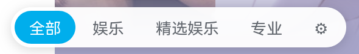
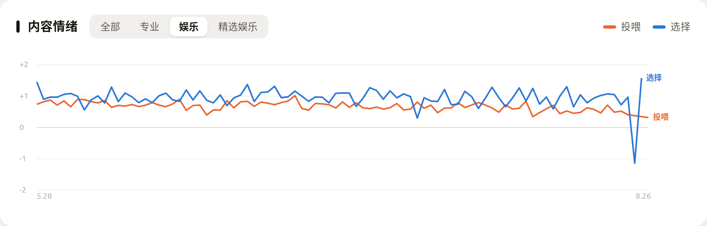
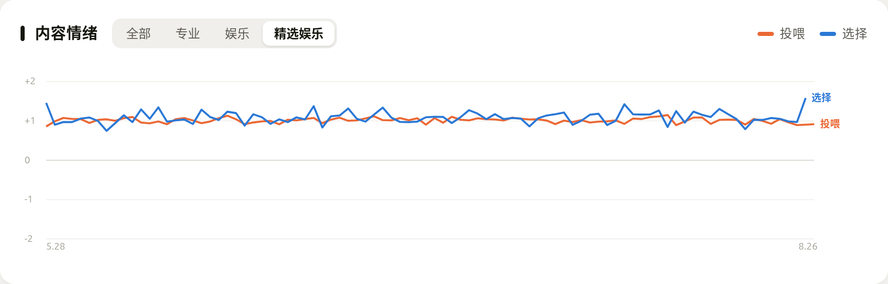

# 首页信息流分类

**为 B站 / YouTube 首页推荐流提供「专业 · 精选娱乐 · 娱乐」一键切换**

[English](README.md) | 中文

## ✨ 功能

- **四种模式**：全部 / 娱乐 / 精选娱乐 / 专业。精选娱乐收治愈、搞笑、才艺、萌宠这类正向内容，滤掉引战、猎奇和贩卖焦虑；专业收科普、技术、财经、纪录片这类语气克制的内容，标题党不算。
- **内置本地模型**：装上即用，离线分类。
- **可选云端复核**：填入 DeepSeek API Key 后精度更高。用量与金额实时显示，「容忍」滑条控制云端调用比例，拉到头就是纯离线。
- 只重排首页卡片，广告、跳转链接和创作者收益都保持原样。

## 📊 过滤效果

用 2,368 条视频实测：先按脚本线上同款提示词分档，再用另一套独立训练的情绪模型给每档打分。

| 模式 | 视频数 | 平均情绪效价 | 负面内容占比 |
|---|---|---|---|
| **精选娱乐** | 1,061 | **+1.09** | **11.9%** |
| 娱乐 | 862 | +0.70 | 24.8% |

从娱乐切到精选娱乐，负面内容占比从 24.8% 降到 11.9%。完整方法与数据见 [`research/LOG.md`](research/LOG.md) 的 E22。

配套的兴趣仪表盘上也能看到这个差距。橙线是推荐流的情绪均值，蓝线是实际点开视频的：

## 🧭 配套：个人兴趣模型

[`interest-model/`](interest-model/README.md) 是可选的本地程序，把浏览记录整理成一个仪表盘：推荐流与实际点开内容的情绪曲线、自选时间窗的词云、新出现的兴趣、开了头没看完的专业视频。数据都存在本机，用户脚本一键连接。

安装：Windows 下载 [interest-model-windows.zip](https://github.com/Kali-Leo/feed-mode/releases/latest/download/interest-model-windows.zip) 解压，双击 `interest-model.exe`；Linux/macOS 运行 `interest-model/start.sh`。仪表盘会自动在浏览器打开；首次运行注册开机自启，之后仪表盘随时可开，细节见其 [README](interest-model/README.md)。

## 📦 安装

1. 安装 [Violentmonkey](https://violentmonkey.github.io/) 或 [Tampermonkey](https://www.tampermonkey.net/)
2. 安装脚本：[B站版](https://greasyfork.org/zh-CN/scripts/592929) · [YouTube版](https://greasyfork.org/zh-CN/scripts/592932)
3. 打开对应网站首页，左下角出现模式开关

界面语言跟随浏览器（中文或英文）。

## 🔑 API Key（可选）

在 [platform.deepseek.com](https://platform.deepseek.com) 申请，点开关条上的 ⚙ 填入，两个站点分别设置。填入后「精选娱乐」这类细分判断明显更准。

脚本本身免费；API 费用由 DeepSeek 按用量计费，金额在开关条上随时可见。

## 🛡️ 隐私

- 填入 Key 后，发给 DeepSeek 的内容是视频标题、作者名和标签；账号、Cookie、观看历史不会发送
- Key 与全部分类数据只存本地浏览器
- B站版调用站内推荐接口预加载内容，相当于多刷几次首页；YouTube 版没有预加载

## 🗂️ 仓库结构

| 路径 | 内容 |
|---|---|
| `bilibili-feed-mode.user.js` | B站用户脚本，内嵌本地分类模型 |
| `youtube-feed-mode.user.js` | YouTube 用户脚本，内嵌本地分类模型 |
| `interest-model/` | 可选配套：个人兴趣仪表盘，见其 [README](interest-model/README.md) |
| `research/` | 实验台账、训练管线与标注数据集，见其 [README](research/README.md) |

## ⚠️ 免责

- 第三方个人工具，与哔哩哔哩、YouTube/Google 及其关联公司无关
- 修改页面显示可能不符合平台协议部分条款，风控风险请自行评估
- 分类由 AI 完成，不保证准确

## 📄 许可证

[GPL-3.0](LICENSE)，喜欢的话点个 ⭐
